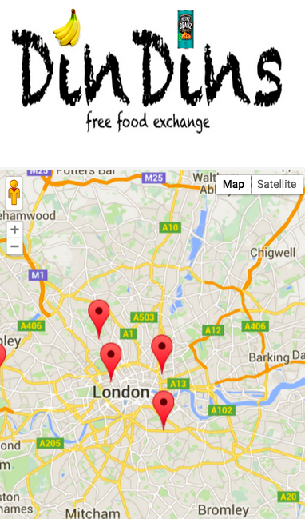

#DINDINS
<h3>A wdi-london group project by: </h3>
<ul>
	<li>Andrea McKenzie</li>
	<li>Franziska Klingner</li>
	<li>Samuel Bagnall</li>
</ul>

#TASK
To build a RESTful API with CRUD functions and atleast two related models. The app must have a front end that consumes the API and have some authentification system to allow for user registration and to restrict access to parts of the API or frontend. 

#IDEA
DINDINS is a social food recycling app. Visitors to the app can see food that is available that would otherwise go to waste, posted by registered users, and sign up to request the food. Once the request has been made (at a time and place specified by the person donating the food), the users enter into a transaction and are committed to meet the requirements of the exchange. Once the transaction has been completed (successfully or otherwise) the users can rate the experience and will have a personal rating - visible to other users - which will be displayed on all future potential transactions.

#TECHNOLOGY
The entire app was built using some variant of JavaScript. The front end uses Ajax to make requests, with a JWT (JSON web token), to the API and renders the results with ejs. The map on the homepage, which shows the location of available foods, is rendered and geocoded on the client side using Google maps.
The back end is a node.js app using Mongoose to access a mongo database. The user passwords are salted and hashed using bcrypt and the product information is retrieved from the Tesco API.
This was a didactic learning proccess so these core technologies - Mongoose, mongo, Ajax and node.js - were chosen to improve our understand and useage of them. We wanted to use an external API to both improve the functionality of the app and to practice with retrieving and proccessing the data.

#CHALLENGES
One of the difficulties with working in a new team is in dividing tasks and this was apparent when, having designed our data models, we had to go back and change them. This meant going back to change other bits of code which had been done in parallel, and our final data models are a comprimise between how they perhaps should be done and the need to deliver a working product.

